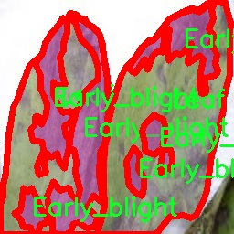

# 改进yolo11-attention等200+全套创新点大全：作物病害检测系统源码＆数据集全套

### 1.图片效果展示


##### 项目来源 **[人工智能促进会 2024.11.01](https://kdocs.cn/l/cszuIiCKVNis)**

注意：由于项目一直在更新迭代，上面“1.图片效果展示”和“2.视频效果展示”展示的系统图片或者视频可能为老版本，新版本在老版本的基础上升级如下：（实际效果以升级的新版本为准）

  （1）适配了YOLOV11的“目标检测”模型和“实例分割”模型，通过加载相应的权重（.pt）文件即可自适应加载模型。

  （2）支持“图片识别”、“视频识别”、“摄像头实时识别”三种识别模式。

  （3）支持“图片识别”、“视频识别”、“摄像头实时识别”三种识别结果保存导出，解决手动导出（容易卡顿出现爆内存）存在的问题，识别完自动保存结果并导出到tempDir中。

  （4）支持Web前端系统中的标题、背景图等自定义修改。

  另外本项目提供训练的数据集和训练教程,暂不提供权重文件（best.pt）,需要您按照教程进行训练后实现图片演示和Web前端界面演示的效果。

### 2.视频效果展示

[2.1 视频效果展示](https://www.bilibili.com/video/BV1paS9YsEZm/)

### 3.背景

研究背景与意义

随着全球气候变化和农业生产方式的转变，作物病害的发生频率和范围逐渐增加，严重影响了农业的可持续发展和粮食安全。作物病害不仅导致农作物减产，还可能引发生态失衡，影响农民的经济收入。因此，及时、准确地检测和识别作物病害，成为现代农业管理中亟待解决的重要问题。传统的人工检测方法不仅耗时耗力，而且容易受到主观因素的影响，导致漏检和误检现象频发。基于计算机视觉和深度学习的自动化检测系统，因其高效性和准确性，逐渐成为研究的热点。

本研究旨在基于改进的YOLOv11模型，构建一个高效的作物病害检测系统。YOLO（You Only Look Once）系列模型以其实时性和高精度的特性，在目标检测领域取得了显著的成果。通过对YOLOv11进行改进，结合Mask RCNN的实例分割能力，我们希望在检测作物病害的同时，提供更为细致的分割信息，从而提高病害识别的准确性和可靠性。研究中使用的数据集包含30张图像，涵盖了早疫病、晚疫病和叶片等类别，为模型的训练和测试提供了基础。

通过对这些数据的深入分析与处理，我们期望能够构建一个具有较强泛化能力的作物病害检测系统，能够在不同环境和条件下有效识别和分类作物病害。这不仅将为农民提供及时的病害预警，帮助其采取有效的防治措施，还将为农业生产的智能化和精准化管理提供重要的技术支持，推动农业科技的进步与发展。

### 4.数据集信息展示

##### 4.1 本项目数据集详细数据（类别数＆类别名）

nc: 3
names: ['Early_blight', 'Late_blight', 'Leaf']


该项目为【图像分割】数据集，请在【训练教程和Web端加载模型教程（第三步）】这一步的时候按照【图像分割】部分的教程来训练

##### 4.2 本项目数据集信息介绍

本项目数据集信息介绍

本项目所使用的数据集名为“Mask RCNN”，其主要目的是为了训练和改进YOLOv11模型在作物病害检测系统中的表现。该数据集包含三种主要类别，分别为“Early_blight”（早期枯萎病）、“Late_blight”（晚期枯萎病）和“Leaf”（叶片健康状态）。通过对这些类别的细致标注和分类，我们能够为模型提供丰富的训练样本，以提高其在实际应用中的准确性和鲁棒性。

在农业生产中，作物病害的早期识别至关重要，能够有效地减少农作物损失，提高产量和质量。为此，Mask RCNN数据集不仅包含了不同病害的图像样本，还涵盖了健康叶片的图像，以便模型能够更好地区分病害与健康状态。这种多样化的样本选择使得模型在训练过程中能够学习到更为复杂的特征，从而在面对实际环境中的多变情况时，依然能够保持较高的识别率。

数据集中的图像经过精心挑选和标注，确保了每个类别的样本在数量和质量上的均衡。这种平衡不仅有助于避免模型在训练过程中出现偏差，还能提高其在不同病害识别上的灵活性。此外，数据集还考虑到了不同生长阶段和环境条件下作物的表现，进一步增强了模型的适应性。

综上所述，Mask RCNN数据集为本项目提供了一个坚实的基础，使得改进后的YOLOv11模型能够在作物病害检测领域发挥更大的作用，助力农业智能化的发展。通过对该数据集的深入分析和应用，我们期望能够实现更高效的病害监测和管理，推动现代农业的可持续发展。




### 5.全套项目环境部署视频教程（零基础手把手教学）

[5.1 所需软件PyCharm和Anaconda安装教程（第一步）](https://www.bilibili.com/video/BV1BoC1YCEKi/?spm_id_from=333.999.0.0&vd_source=bc9aec86d164b67a7004b996143742dc)


[5.2 安装Python虚拟环境创建和依赖库安装视频教程（第二步）](https://www.bilibili.com/video/BV1ZoC1YCEBw?spm_id_from=333.788.videopod.sections&vd_source=bc9aec86d164b67a7004b996143742dc)

### 6.改进YOLOv11训练教程和Web_UI前端加载模型教程（零基础手把手教学）

[6.1 改进YOLOv11训练教程和Web_UI前端加载模型教程（第三步）](https://www.bilibili.com/video/BV1BoC1YCEhR?spm_id_from=333.788.videopod.sections&vd_source=bc9aec86d164b67a7004b996143742dc)


按照上面的训练视频教程链接加载项目提供的数据集，运行train.py即可开始训练



     Epoch   gpu_mem       box       obj       cls    labels  img_size
     1/200     20.8G   0.01576   0.01955  0.007536        22      1280: 100%|██████████| 849/849 [14:42<00:00,  1.04s/it]
               Class     Images     Labels          P          R     mAP@.5 mAP@.5:.95: 100%|██████████| 213/213 [01:14<00:00,  2.87it/s]
                 all       3395      17314      0.994      0.957      0.0957      0.0843

     Epoch   gpu_mem       box       obj       cls    labels  img_size
     2/200     20.8G   0.01578   0.01923  0.007006        22      1280: 100%|██████████| 849/849 [14:44<00:00,  1.04s/it]
               Class     Images     Labels          P          R     mAP@.5 mAP@.5:.95: 100%|██████████| 213/213 [01:12<00:00,  2.95it/s]
                 all       3395      17314      0.996      0.956      0.0957      0.0845

     Epoch   gpu_mem       box       obj       cls    labels  img_size
     3/200     20.8G   0.01561    0.0191  0.006895        27      1280: 100%|██████████| 849/849 [10:56<00:00,  1.29it/s]
               Class     Images     Labels          P          R     mAP@.5 mAP@.5:.95: 100%|███████   | 187/213 [00:52<00:00,  4.04it/s]
                 all       3395      17314      0.996      0.957      0.0957      0.0845


###### [项目数据集下载链接](https://kdocs.cn/l/cszuIiCKVNis)

### 7.原始YOLOv11算法讲解


YOLO11 是 Ultralytics YOLO 系列的最新版本，结合了尖端的准确性、速度和效率，用于目标检测、分割、分类、定向边界框和姿态估计。与
YOLOv8 相比，它具有更少的参数和更好的结果，不难预见，YOLO11 在边缘设备上更高效、更快，将频繁出现在计算机视觉领域的最先进技术（SOTA）中。


**主要特点**

  * **增强的特征提取：**YOLO11 使用改进的主干和颈部架构来增强特征提取，以实现更精确的目标检测和复杂任务的性能。

  * **针对效率和速度优化：**精细的架构设计和优化的训练流程在保持准确性和性能之间最佳平衡的同时，提供更快的处理速度。

  * **更少的参数，更高的准确度：**YOLO11m 在 COCO 数据集上实现了比 YOLOv8m 更高的 mAP，参数减少了 22%，提高了计算效率，同时不牺牲准确度。

  * **跨环境的适应性：**YOLO11 可以无缝部署在边缘设备、云平台和配备 NVIDIA GPU 的系统上，确保最大的灵活性。

  * **支持广泛的任务范围：**YOLO11 支持各种计算机视觉任务，如目标检测、实例分割、图像分类、姿态估计和定向目标检测（OBB）。


### 8.200+种全套改进YOLOV11创新点原理讲解

#### 8.1 200+种全套改进YOLOV11创新点原理讲解大全

由于篇幅限制，每个创新点的具体原理讲解就不全部展开，具体见下列网址中的改进模块对应项目的技术原理博客网址【Blog】（创新点均为模块化搭建，原理适配YOLOv5~YOLOv11等各种版本）

[改进模块技术原理博客【Blog】网址链接](https://gitee.com/qunmasj/good)


#### 8.2 精选部分改进YOLOV11创新点原理讲解

###### 这里节选部分改进创新点展开原理讲解(完整的改进原理见上图和[改进模块技术原理博客链接](https://gitee.com/qunmasj/good)【如果此小节的图加载失败可以通过CSDN或者Github搜索该博客的标题访问原始博客，原始博客图片显示正常】


### D-LKA Attention简介
自2010年代中期以来，卷积神经网络（CNNs）已成为许多计算机视觉应用的首选技术。它们能够从原始数据中自动提取复杂的特征表示，无需手动进行特征工程，这引起了医学图像分析社区的极大兴趣。许多成功的CNN架构，如U-Net、全卷积网络、DeepLab或SegCaps（分割胶囊），已经被开发出来。这些架构在语义分割任务中取得了巨大成功，先前的最新方法已经被超越。

在计算机视觉研究中，不同尺度下的目标识别是一个关键问题。在CNN中，可检测目标的大小与相应网络层的感受野尺寸密切相关。如果一个目标扩展到超出这个感受野的边界，这可能会导致欠分割结果。相反，与目标实际大小相比使用过大的感受野可能会限制识别，因为背景信息可能会对预测产生不必要的影响。

解决这个问题的一个有希望的方法涉及在并行使用具有不同尺寸的多个Kernel，类似于Inception块的机制。然而，由于参数和计算要求的指数增长，将Kernel大小增加以容纳更大的目标在实践中受到限制。因此，出现了各种策略，包括金字塔池化技术和不同尺度的扩张卷积，以捕获多尺度的上下文信息。

另一个直观的概念涉及将多尺度图像金字塔或它们的相关特征表示直接纳入网络架构。然而，这种方法存在挑战，特别是在管理训练和推理时间方面的可行性方面存在挑战。在这个背景下，使用编码器-解码器网络，如U-Net，已被证明是有利的。这样的网络在较浅的层中编码外观和位置，而在更深的层中，通过神经元的更广泛的感受野捕获更高的语义信息和上下文信息。

一些方法将来自不同层的特征组合在一起，或者预测来自不同尺寸的层的特征以使用多尺度的信息。此外，出现了从不同尺度的层中预测特征的方法，有效地实现了跨多个尺度的见解整合。然而，大多数编码器-解码器结构面临一个挑战：它们经常无法在不同尺度之间保持一致的特征，并主要使用最后一个解码器层生成分割结果。

语义分割是一项任务，涉及根据预定义的标签集为图像中的每个像素预测语义类别。这项任务要求提取高级特征同时保留初始的空间分辨率。CNNs非常适合捕获局部细节和低级信息，尽管以忽略全局上下文为代价。视觉Transformer（ViT）架构已经成为解决处理全局信息的视觉任务的关键，包括语义分割，取得了显著的成功。

ViT的基础是注意力机制，它有助于在整个输入序列上聚合信息。这种能力使网络能够合并远程的上下文提示，超越了CNN的有限感受野尺寸。然而，这种策略通常会限制ViT有效建模局部信息的能力。这种局限可能会妨碍它们检测局部纹理的能力，这对于各种诊断和预测任务至关重要。这种缺乏局部表示可以归因于ViT模型处理图像的特定方式。

ViT模型将图像分成一系列Patch，并使用自注意力机制来模拟它们之间的依赖关系。这种方法可能不如CNN模型中的卷积操作对感受野内提取局部特征有效。ViT和CNN模型之间的这种图像处理方法的差异可能解释了CNN模型在局部特征提取方面表现出色的原因。

近年来，已经开发出创新性方法来解决Transformer模型内部局部纹理不足的问题。其中一种方法是通过互补方法将CNN和ViT特征结合起来，以结合它们的优势并减轻局部表示的不足。TransUNet是这种方法的早期示例，它在CNN的瓶颈中集成了Transformer层，以模拟局部和全局依赖关系。HiFormer提出了一种解决方案，将Swin Transformer模块和基于CNN的编码器结合起来，生成两个多尺度特征表示，通过Double-Level Fusion模块集成。UNETR使用基于Transformer的编码器和CNN解码器进行3D医学图像分割。CoTr和TransBTS通过Transformer在低分辨率阶段增强分割性能，将CNN编码器和解码器连接在一起。

增强局部特征表示的另一种策略是重新设计纯Transformer模型内部的自注意力机制。在这方面，Swin-Unet在U形结构中集成了一个具有线性计算复杂性的Swin Transformer块作为多尺度 Backbone 。MISSFormer采用高效Transformer来解决视觉Transformer中的参数问题，通过在输入块上进行不可逆的降采样操作。D-Former引入了一个纯Transformer的管道，具有双重注意模块，以分段的方式捕获细粒度的局部注意和与多元单元的交互。然而，仍然存在一些特定的限制，包括计算效率低下，如TransUNet模型所示，对CNN Backbone 的严重依赖，如HiFormer所观察到的，以及对多尺度信息的忽略。

此外，目前的分割架构通常采用逐层处理3D输入 volumetric 的方法，无意中忽视了相邻切片之间的潜在相关性。这一疏忽限制了对 volumetric 信息的全面利用，因此损害了定位精度和上下文集成。此外，必须认识到，医学领域的病变通常在形状上发生变形。因此，用于医学图像分析的任何学习算法都必须具备捕捉和理解这些变形的能力。与此同时，该算法应保持计算效率，以便处理3D volumetric数据。

为了解决上述提到的挑战，作者提出了一个解决方案，即可变形大卷积核注意力模块（Deformable LKA module），它是作者网络设计的基本构建模块。这个模块明确设计成在有效处理上下文信息的同时保留局部描述符。作者的架构在这两个方面的平衡增强了实现精确语义分割的能力。

值得注意的是，参考该博客引入了一种基于数据的感受野的动态适应，不同于传统卷积操作中的固定滤波器Mask。这种自适应方法使作者能够克服与静态方法相关的固有限制。这种创新方法还扩展到了D-LKA Net架构的2D和3D版本的开发。

在3D模型的情况下，D-LKA机制被量身定制以适应3D环境，从而实现在不同 volumetric 切片之间无缝信息交互。最后，作者的贡献通过其计算效率得到进一步强调。作者通过仅依靠D-LKA概念的设计来实现这一点，在各种分割基准上取得了显著的性能，确立了作者的方法作为一种新的SOTA方法。

在本节中，作者首先概述方法论。首先，作者回顾了由Guo等人引入的大卷积核注意力（Large Kernel Attention，LKA）的概念。然后，作者介绍了作者对可变形LKA模块的创新探索。在此基础上，作者介绍了用于分割任务的2D和3D网络架构。

大卷积核提供了与自注意力机制类似的感受野。可以通过使用深度卷积、深度可扩展卷积和卷积来构建大卷积核，从而减少了参数和计算量。构建输入维度为和通道数的卷积核的深度卷积和深度可扩展卷积的卷积核大小的方程如下：


具有卷积核大小和膨胀率。参数数量和浮点运算（FLOPs）的计算如下：


FLOPs的数量与输入图像的大小成线性增长。参数的数量随通道数和卷积核大小的增加而呈二次增长。然而，由于它们通常都很小，因此它们不是限制因素。

为了最小化对于固定卷积核大小K的参数数量，可以将方程3对于膨胀率的导数设定为零：


例如，当卷积核大小为时，结果是。将这些公式扩展到3D情况是直接的。对于大小为和通道数C的输入，3D情况下参数数量和FLOPs 的方程如下：


具有卷积核大小和膨胀。


利用大卷积核进行医学图像分割的概念通过引入可变形卷积得以扩展。可变形卷积可以通过整数偏移自由调整采样网格以进行自由变形。额外的卷积层从特征图中学习出变形，从而创建一个偏移场。基于特征本身学习变形会导致自适应卷积核。这种灵活的卷积核形状可以提高病变或器官变形的表示，从而增强了目标边界的定义。

负责计算偏移的卷积层遵循其相应卷积层的卷积核大小和膨胀。双线性插值用于计算不在图像网格上的偏移的像素值。如图2所示，D-LKA模块可以表示为：


其中输入特征由表示，。表示为注意力图，其中每个值表示相应特征的相对重要性。运算符  表示逐元素乘法运算。值得注意的是，LKA不同于传统的注意力方法，它不需要额外的规范化函数，如或。这些规范化函数往往忽视高频信息，从而降低了基于自注意力的方法的性能。

在该方法的2D版本中，卷积层被可变形卷积所替代，因为可变形卷积能够改善对具有不规则形状和大小的目标的捕捉能力。这些目标在医学图像数据中常常出现，因此这种增强尤为重要。

然而，将可变形LKA的概念扩展到3D领域会带来一定的挑战。主要的约束来自于需要用于生成偏移的额外卷积层。与2D情况不同，由于输入和输出通道的性质，这一层无法以深度可分的方式执行。在3D环境中，输入通道对应于特征，而输出通道扩展到，其中是卷积核的大小。大卷积核的复杂性导致沿第3D的通道数扩展，导致参数和FLOPs大幅增加。因此，针对3D情况采用了另一种替代方法。在现有的LKA框架中，深度卷积之后引入了一个单独的可变形卷积层。这种战略性的设计调整旨在减轻扩展到3D领域所带来的挑战。


2D网络的架构如图1所示。第一变种使用MaxViT作为编码器组件，用于高效特征提取，而第二变种则结合可变形LKA层进行更精细、卓越的分割。

在更正式的描述中，编码器生成4个分层输出表示。首先，卷积干扰将输入图像的维度减小到。随后，通过4个MaxViT块的4个阶段进行特征提取，每个阶段后跟随降采样层。随着过程进展到解码器，实施了4个阶段的D-LKA层，每个阶段包含2个D-LKA块。然后，应用Patch扩展层以实现分辨率上采样，同时减小通道维度。最后，线性层负责生成最终的输出。

2D D-LKA块的结构包括LayerNorm、可变形LKA和多层感知器（MLP）。积分残差连接确保了有效的特征传播，即使在更深层也是如此。这个安排可以用数学方式表示为：


其中输入特征，层归一化LN，可变形LKA注意力，深度卷积，线性层和GeLU激活函数。

3D网络架构如图1所示，采用编码器-解码器设计进行分层结构化。首先，一个Patch嵌入层将输入图像的维度从（）减小到（）。在编码器中，采用了3个D-LKA阶段的序列，每个阶段包含3个D-LKA块。在每个阶段之后，通过降采样步骤将空间分辨率减半，同时将通道维度加倍。中央瓶颈包括另一组2个D-LKA块。解码器结构与编码器相对称。

为了将特征分辨率加倍，同时减少通道数，使用转置卷积。每个解码器阶段都使用3个D-LKA块来促进远距离特征依赖性。最终的分割输出由一个卷积层产生，后面跟随一个卷积层以匹配特定类别的通道要求。

为了建立输入图像和分割输出之间的直接连接，使用卷积形成了一个跳跃连接。额外的跳跃连接根据简单的加法对来自其他阶段的特征进行融合。最终的分割图是通过和卷积层的组合产生的。

3D D-LKA块包括层归一化，后跟D-LKA注意力，应用了残差连接的部分。随后的部分采用了一个卷积层，后面跟随一个卷积层，两者都伴随着残差连接。这个整个过程可以总结如下：


带有输入特征 、层归一化 、可变形 LKA 、卷积层 和输出特征 的公式。是指一个前馈网络，包括2个卷积层和激活函数。

表7显示了普通卷积和构建卷积的参数数量比较。尽管标准卷积的参数数量在通道数较多时急剧增加，但分解卷积的参数总体较低，并且增长速度不那么快。

与分解卷积相比，可变形分解卷积增加了大量参数，但仍然明显小于标准卷积。可变形卷积的主要参数是由偏移网络创建的。在这里，作者假设可变形深度卷积的Kernel大小为（5,5），可变形深度空洞卷积的Kernel大小为（7,7）。这导致了21×21大小的大Kernel的最佳参数数量。更高效地生成偏移量的方法将大大减少参数数量。


值得注意的是，引入可变形LKA确实会增加模型的参数数量和每秒的浮点运算次数（FLOPS）。然而，重要的是强调，这增加的计算负载不会影响作者模型的整体推理速度。

相反，对于Batch-size > 1，作者甚至观察到推理时间的减少，如图7所示。例如，基于作者的广泛实验，作者观察到对于Batch-size为16，具有可变形卷积和没有可变形卷积的推理时间分别为8.01毫秒和17.38毫秒。作者认为这是由于在2D中对可变形卷积的高效实现所致。为了测量时间，使用了大小为（）的随机输入。在GPU热身周期50次迭代之后，网络被推断了1000次。测量是在NVIDIA RTX 3090 GPU上进行的。


为了充分利用性能与参数之间的权衡关系，作者在图8中可视化了在Synapse 2D数据集上报告的DSC和HD性能以及基于参数数量的内存消耗。D-LKA Net引入了相当多的参数，约为101M。这比性能第二好的方法ScaleFormer使用的111.6M参数要少。

与更轻量级的DAEFormer模型相比，作者实现了更好的性能，这证明了参数增加的合理性。大多数参数来自于MaxViT编码器；因此，将编码器替换为更高效的编码器可以减少模型参数。值得注意的是，在此可视化中，作者最初将HD和内存值都归一化到[0, 100]范围内。随后，作者将它们从100缩小，以增强更高值的表示。


### 9.系统功能展示

图9.1.系统支持检测结果表格显示

  图9.2.系统支持置信度和IOU阈值手动调节

  图9.3.系统支持自定义加载权重文件best.pt(需要你通过步骤5中训练获得)

  图9.4.系统支持摄像头实时识别

  图9.5.系统支持图片识别

  图9.6.系统支持视频识别

  图9.7.系统支持识别结果文件自动保存

  图9.8.系统支持Excel导出检测结果数据


### 10. YOLOv11核心改进源码讲解

#### 10.1 dyhead_prune.py

以下是对代码中最核心部分的分析和详细注释。代码主要实现了一些自定义的激活函数、动态ReLU模块、动态卷积模块以及一个结合了这些模块的DyHeadBlock。

```python
import torch
import torch.nn as nn
import torch.nn.functional as F

# 定义一个函数用于将输入值调整为可被指定的除数整除的值
def _make_divisible(v, divisor, min_value=None):
    if min_value is None:
        min_value = divisor
    new_v = max(min_value, int(v + divisor / 2) // divisor * divisor)
    # 确保向下取整不会超过原值的90%
    if new_v < 0.9 * v:
        new_v += divisor
    return new_v

# Swish激活函数
class swish(nn.Module):
    def forward(self, x):
        return x * torch.sigmoid(x)

# Hard Swish激活函数
class h_swish(nn.Module):
    def __init__(self, inplace=False):
        super(h_swish, self).__init__()
        self.inplace = inplace

    def forward(self, x):
        return x * F.relu6(x + 3.0, inplace=self.inplace) / 6.0

# Hard Sigmoid激活函数
class h_sigmoid(nn.Module):
    def __init__(self, inplace=True, h_max=1):
        super(h_sigmoid, self).__init__()
        self.relu = nn.ReLU6(inplace=inplace)
        self.h_max = h_max

    def forward(self, x):
        return self.relu(x + 3) * self.h_max / 6

# 动态ReLU模块
class DyReLU(nn.Module):
    def __init__(self, inp, reduction=4, lambda_a=1.0, K2=True, use_bias=True, use_spatial=False,
                 init_a=[1.0, 0.0], init_b=[0.0, 0.0]):
        super(DyReLU, self).__init__()
        self.oup = inp  # 输出通道数
        self.lambda_a = lambda_a * 2  # 动态调整因子
        self.K2 = K2  # 控制参数
        self.avg_pool = nn.AdaptiveAvgPool2d(1)  # 自适应平均池化

        # 确定压缩比
        squeeze = inp // reduction if reduction == 4 else _make_divisible(inp // reduction, 4)

        # 定义全连接层
        self.fc = nn.Sequential(
            nn.Linear(inp, squeeze),
            nn.ReLU(inplace=True),
            nn.Linear(squeeze, self.oup * (4 if K2 else 2)),
            h_sigmoid()
        )
        self.spa = nn.Sequential(
            nn.Conv2d(inp, 1, kernel_size=1),
            nn.BatchNorm2d(1),
        ) if use_spatial else None

    def forward(self, x):
        # 处理输入
        x_in = x[0] if isinstance(x, list) else x
        x_out = x[1] if isinstance(x, list) else x
        b, c, h, w = x_in.size()  # 获取输入的尺寸
        y = self.avg_pool(x_in).view(b, c)  # 平均池化
        y = self.fc(y).view(b, self.oup * (4 if self.K2 else 2), 1, 1)  # 全连接层输出

        # 计算动态ReLU的输出
        # 省略了具体的计算细节以简化代码
        out = ...  # 计算逻辑

        if self.spa:
            ys = self.spa(x_in).view(b, -1)
            ys = F.softmax(ys, dim=1).view(b, 1, h, w) * h * w
            ys = F.hardtanh(ys, 0, 3, inplace=True) / 3
            out = out * ys  # 加入空间注意力

        return out

# 动态卷积模块
class DyDCNv2(nn.Module):
    def __init__(self, in_channels, out_channels, stride=1, norm_cfg=dict(type='GN', num_groups=16, requires_grad=True)):
        super().__init__()
        self.conv = ModulatedDeformConv2d(in_channels, out_channels, 3, stride=stride, padding=1)
        self.norm = build_norm_layer(norm_cfg, out_channels)[1] if norm_cfg else None

    def forward(self, x, offset, mask):
        x = self.conv(x.contiguous(), offset, mask)  # 进行动态卷积
        if self.norm:
            x = self.norm(x)  # 进行归一化
        return x

# DyHead模块
class DyHeadBlock_Prune(nn.Module):
    def __init__(self, in_channels, norm_type='GN', zero_init_offset=True, act_cfg=dict(type='HSigmoid', bias=3.0, divisor=6.0)):
        super().__init__()
        self.spatial_conv_high = DyDCNv2(in_channels, in_channels)
        self.spatial_conv_mid = DyDCNv2(in_channels, in_channels)
        self.spatial_conv_low = DyDCNv2(in_channels, in_channels, stride=2)
        self.spatial_conv_offset = nn.Conv2d(in_channels, 27, 3, padding=1)  # 计算偏移和掩码
        self.scale_attn_module = nn.Sequential(
            nn.AdaptiveAvgPool2d(1), nn.Conv2d(in_channels, 1, 1),
            nn.ReLU(inplace=True), build_activation_layer(act_cfg)
        )
        self.task_attn_module = DyReLU(in_channels)
        self._init_weights()

    def _init_weights(self):
        for m in self.modules():
            if isinstance(m, nn.Conv2d):
                normal_init(m, 0, 0.01)  # 初始化卷积层

    def forward(self, x, level):
        offset_and_mask = self.spatial_conv_offset(x[level])  # 计算偏移和掩码
        offset = offset_and_mask[:, :18, :, :]  # 提取偏移
        mask = offset_and_mask[:, 18:, :, :].sigmoid()  # 提取掩码并应用sigmoid

        mid_feat = self.spatial_conv_mid(x[level], offset, mask)  # 中间特征
        sum_feat = mid_feat * self.scale_attn_module(mid_feat)  # 加权特征

        # 处理低层和高层特征
        if level > 0:
            low_feat = self.spatial_conv_low(x[level - 1], offset, mask)
            sum_feat += low_feat * self.scale_attn_module(low_feat)
        if level < len(x) - 1:
            high_feat = F.interpolate(self.spatial_conv_high(x[level + 1], offset, mask), size=x[level].shape[-2:], mode='bilinear', align_corners=True)
            sum_feat += high_feat * self.scale_attn_module(high_feat)

        return self.task_attn_module(sum_feat / 3)  # 返回最终特征
```

### 代码核心部分总结：
1. **激活函数**：实现了多种激活函数，包括Swish、Hard Swish和Hard Sigmoid，适用于不同的网络需求。
2. **动态ReLU**：通过自适应的方式调整激活函数的输出，增强了模型的表达能力。
3. **动态卷积**：实现了一个支持偏移和掩码的动态卷积模块，能够根据输入特征动态调整卷积操作。
4. **DyHead模块**：整合了动态卷积和注意力机制，能够有效地处理多层特征，提升模型的性能。

这些模块的组合使得模型在处理复杂任务时能够更加灵活和高效。

这个文件 `dyhead_prune.py` 实现了一个动态头部（Dynamic Head）模块，主要用于计算机视觉任务中的特征提取和处理。代码中使用了 PyTorch 框架，并且定义了一些自定义的激活函数和卷积层，结合了动态卷积和注意力机制。以下是对代码的逐步分析。

首先，导入了必要的库，包括 PyTorch 的核心模块和一些特定的操作模块，如 `ModulatedDeformConv2d`。接着定义了一个 `_make_divisible` 函数，用于确保某个值是可被指定的除数整除的，并且在必要时会调整该值以满足最小值的要求。

接下来，定义了几个自定义的激活函数类，包括 `swish`、`h_swish` 和 `h_sigmoid`。这些激活函数在深度学习中常用于提升模型的非线性表达能力。`h_swish` 和 `h_sigmoid` 特别是基于 ReLU6 的变体，适用于一些特定的网络架构。

`DyReLU` 类是一个动态激活函数模块，具有可调的参数。它根据输入特征的统计信息（通过全局平均池化获得）来动态调整激活函数的输出。该模块的设计允许在训练过程中根据特征的分布自适应地调整激活值，从而增强模型的表达能力。

`DyDCNv2` 类实现了带有归一化层的可调变形卷积（Modulated Deformable Convolution），这是一个灵活的卷积操作，能够根据输入特征动态调整卷积核的位置和形状。该类支持多种归一化方法，具体取决于传入的配置。

`DyHeadBlock_Prune` 类是整个模块的核心部分，结合了多个注意力机制。它使用了三个不同层次的卷积操作来处理输入特征，并通过计算偏移量和掩码来动态调整卷积操作。这个模块的设计使得它能够在不同的特征层次上进行信息融合，从而提升模型的性能。

在 `DyHeadBlock_Prune` 的构造函数中，初始化了多个卷积层和注意力模块，并且定义了权重初始化的方法。`forward` 方法则实现了前向传播过程，计算特征的偏移量和掩码，并通过不同层次的卷积操作融合特征。

总体来说，这个文件实现了一个复杂的动态特征提取模块，结合了动态卷积、注意力机制和自适应激活函数，旨在提升计算机视觉任务中的特征表示能力。

#### 10.2 TransNext.py

以下是代码中最核心的部分，并附上详细的中文注释：

```python
try:
    # 尝试导入 swattention 模块和 TransNext_cuda 中的所有内容
    import swattention
    from ultralytics.nn.backbone.TransNeXt.TransNext_cuda import *
except ImportError as e:
    # 如果导入失败（例如，模块不存在），则执行以下代码
    # 导入 TransNext_native 中的所有内容
    from ultralytics.nn.backbone.TransNeXt.TransNext_native import *
    pass
```

### 注释说明：
1. **try 块**：尝试执行一段代码，如果代码中发生异常（如模块未找到），则会跳转到 except 块。
2. **import swattention**：导入名为 `swattention` 的模块，可能是用于某种特定的注意力机制。
3. **from ... import ***：从 `TransNext_cuda` 模块中导入所有内容，这通常是一个 CUDA 加速的实现，适用于支持 GPU 的环境。
4. **except ImportError as e**：捕获导入时发生的 `ImportError` 异常，`as e` 语句可以将异常信息存储在变量 `e` 中（虽然在这里并没有使用）。
5. **from ... import ***：如果前面的导入失败，则从 `TransNext_native` 模块中导入所有内容，这通常是一个不依赖于 CUDA 的实现，适用于 CPU 环境或没有 GPU 的情况。
6. **pass**：在 except 块中使用 `pass` 表示不执行任何操作，继续执行后面的代码。

这个程序文件名为 `TransNext.py`，其主要功能是导入与 `TransNeXt` 相关的模块。代码的结构使用了 `try...except` 语句，这是一种异常处理机制。

首先，程序尝试导入 `swattention` 模块和 `TransNext_cuda` 中的所有内容。如果这两个模块能够成功导入，程序将继续执行这些导入的内容。`TransNext_cuda` 可能是一个专门为 CUDA（即用于并行计算的 NVIDIA 图形处理单元）优化的版本，通常用于加速深度学习模型的训练和推理过程。

如果在导入过程中发生 `ImportError` 异常，程序将进入 `except` 块。在这里，它将尝试导入 `TransNext_native` 模块，而不是 CUDA 版本。这表明 `TransNext_native` 是一个不依赖于 CUDA 的实现，可能适用于不支持 CUDA 的环境。

总的来说，这段代码的设计目的是为了确保在不同的环境中都能找到合适的 `TransNeXt` 实现，从而提高程序的兼容性和灵活性。

#### 10.3 predict.py

以下是代码中最核心的部分，并附上详细的中文注释：

```python
from ultralytics.engine.predictor import BasePredictor
from ultralytics.engine.results import Results
from ultralytics.utils import ops

class DetectionPredictor(BasePredictor):
    """
    DetectionPredictor类用于基于检测模型进行预测。
    该类继承自BasePredictor类，主要实现了后处理预测结果的功能。
    """

    def postprocess(self, preds, img, orig_imgs):
        """
        对预测结果进行后处理，并返回一个Results对象的列表。

        参数:
        preds: 模型的原始预测结果
        img: 输入图像
        orig_imgs: 原始输入图像（可能是torch.Tensor或numpy数组）

        返回:
        results: 包含后处理结果的Results对象列表
        """
        # 使用非极大值抑制（NMS）来过滤预测框
        preds = ops.non_max_suppression(
            preds,
            self.args.conf,  # 置信度阈值
            self.args.iou,   # IOU阈值
            agnostic=self.args.agnostic_nms,  # 是否进行类别无关的NMS
            max_det=self.args.max_det,  # 最大检测框数量
            classes=self.args.classes,   # 需要检测的类别
        )

        # 如果输入的原始图像不是列表，说明是torch.Tensor格式，需转换为numpy数组
        if not isinstance(orig_imgs, list):
            orig_imgs = ops.convert_torch2numpy_batch(orig_imgs)

        results = []  # 存储后处理结果的列表
        for i, pred in enumerate(preds):
            orig_img = orig_imgs[i]  # 获取对应的原始图像
            # 将预测框的坐标从当前图像的尺寸缩放到原始图像的尺寸
            pred[:, :4] = ops.scale_boxes(img.shape[2:], pred[:, :4], orig_img.shape)
            img_path = self.batch[0][i]  # 获取当前图像的路径
            # 创建Results对象并添加到结果列表中
            results.append(Results(orig_img, path=img_path, names=self.model.names, boxes=pred))
        
        return results  # 返回后处理的结果列表
```

### 代码核心部分解析：
1. **类定义**：`DetectionPredictor`类用于处理基于YOLO模型的目标检测预测，继承自`BasePredictor`。
2. **后处理方法**：`postprocess`方法对模型的预测结果进行后处理，包括非极大值抑制和坐标缩放。
3. **非极大值抑制**：通过`ops.non_max_suppression`函数来过滤掉重叠的预测框，保留最有可能的检测结果。
4. **图像格式转换**：确保原始图像为numpy数组格式，以便后续处理。
5. **结果存储**：将处理后的结果封装成`Results`对象，包含原始图像、图像路径、类别名称和预测框信息，最终返回结果列表。

这个程序文件 `predict.py` 是一个用于目标检测的预测类，基于 Ultralytics YOLO 模型。它扩展了 `BasePredictor` 类，提供了一个专门用于处理检测模型预测的功能。

在文件的开头，首先导入了必要的模块，包括 `BasePredictor`、`Results` 和一些实用的操作函数 `ops`。接着定义了 `DetectionPredictor` 类，这个类主要负责处理模型的预测结果。

类中包含一个方法 `postprocess`，这个方法的作用是对模型的预测结果进行后处理，并返回一个包含结果的列表。具体来说，`postprocess` 方法接收三个参数：`preds`（模型的预测结果）、`img`（输入图像）和 `orig_imgs`（原始图像）。在方法内部，首先使用非极大值抑制（NMS）来过滤掉冗余的检测框，确保每个目标只保留一个最佳的检测框。这个过程是通过调用 `ops.non_max_suppression` 实现的，参数包括置信度阈值、IoU 阈值、是否使用类别无关的 NMS、最大检测框数量以及要检测的类别。

接下来，方法检查 `orig_imgs` 是否为列表。如果不是，说明输入图像是一个 PyTorch 张量，此时需要将其转换为 NumPy 数组。然后，程序会遍历每个预测结果，使用 `ops.scale_boxes` 方法将检测框的坐标从缩放后的图像尺寸转换回原始图像的尺寸。每个结果都会被封装成一个 `Results` 对象，包含原始图像、图像路径、模型名称和检测框信息。

最后，所有的结果对象会被收集到一个列表中并返回。这段代码展示了如何将模型的输出进行有效的后处理，以便于后续的结果分析和可视化。

#### 10.4 efficientViT.py

以下是经过简化和注释的核心代码部分，保留了EfficientViT模型的主要结构和功能。

```python
import torch
import torch.nn as nn
import torch.nn.functional as F
import itertools

# 定义卷积层和批归一化的组合类
class Conv2d_BN(torch.nn.Sequential):
    def __init__(self, in_channels, out_channels, kernel_size=1, stride=1, padding=0, dilation=1, groups=1, bn_weight_init=1):
        super().__init__()
        # 添加卷积层
        self.add_module('conv', torch.nn.Conv2d(in_channels, out_channels, kernel_size, stride, padding, dilation, groups, bias=False))
        # 添加批归一化层
        self.add_module('bn', torch.nn.BatchNorm2d(out_channels))
        # 初始化批归一化的权重
        torch.nn.init.constant_(self.bn.weight, bn_weight_init)
        torch.nn.init.constant_(self.bn.bias, 0)

    @torch.no_grad()
    def switch_to_deploy(self):
        # 将训练模式下的卷积和批归一化合并为一个卷积层
        conv, bn = self._modules.values()
        w = bn.weight / (bn.running_var + bn.eps)**0.5
        w = conv.weight * w[:, None, None, None]
        b = bn.bias - bn.running_mean * bn.weight / (bn.running_var + bn.eps)**0.5
        return torch.nn.Conv2d(w.size(1) * conv.groups, w.size(0), w.shape[2:], stride=conv.stride, padding=conv.padding, dilation=conv.dilation, groups=conv.groups, bias=True).weight.data.copy_(w), b

# 定义高效ViT块
class EfficientViTBlock(torch.nn.Module):
    def __init__(self, in_channels, key_dim, num_heads=8, resolution=14):
        super().__init__()
        # 定义残差卷积层
        self.dw0 = nn.Sequential(Conv2d_BN(in_channels, in_channels, kernel_size=3, stride=1, padding=1, groups=in_channels))
        # 定义前馈网络
        self.ffn0 = nn.Sequential(Conv2d_BN(in_channels, in_channels * 2), nn.ReLU(), Conv2d_BN(in_channels * 2, in_channels))

        # 定义局部窗口注意力机制
        self.mixer = LocalWindowAttention(in_channels, key_dim, num_heads, resolution=resolution)

        self.dw1 = nn.Sequential(Conv2d_BN(in_channels, in_channels, kernel_size=3, stride=1, padding=1, groups=in_channels))
        self.ffn1 = nn.Sequential(Conv2d_BN(in_channels, in_channels * 2), nn.ReLU(), Conv2d_BN(in_channels * 2, in_channels))

    def forward(self, x):
        # 前向传播
        return self.ffn1(self.dw1(self.mixer(self.ffn0(self.dw0(x)))))


class EfficientViT(torch.nn.Module):
    def __init__(self, img_size=400, patch_size=16, embed_dim=[64, 128, 192], depth=[1, 2, 3], num_heads=[4, 4, 4]):
        super().__init__()
        # 初始化图像嵌入层
        self.patch_embed = nn.Sequential(
            Conv2d_BN(3, embed_dim[0] // 8, kernel_size=3, stride=2, padding=1),
            nn.ReLU(),
            Conv2d_BN(embed_dim[0] // 8, embed_dim[0] // 4, kernel_size=3, stride=2, padding=1),
            nn.ReLU(),
            Conv2d_BN(embed_dim[0] // 4, embed_dim[0] // 2, kernel_size=3, stride=2, padding=1),
            nn.ReLU(),
            Conv2d_BN(embed_dim[0] // 2, embed_dim[0], kernel_size=3, stride=1, padding=1)
        )

        # 构建多个高效ViT块
        self.blocks = nn.ModuleList()
        for i in range(len(depth)):
            for _ in range(depth[i]):
                self.blocks.append(EfficientViTBlock(embed_dim[i], key_dim=16, num_heads=num_heads[i]))

    def forward(self, x):
        # 前向传播
        x = self.patch_embed(x)
        for block in self.blocks:
            x = block(x)
        return x

# 示例模型创建
if __name__ == '__main__':
    model = EfficientViT()
    inputs = torch.randn((1, 3, 640, 640))  # 创建一个随机输入
    res = model(inputs)  # 通过模型进行前向传播
    print(res.size())  # 输出结果的尺寸
```

### 代码注释说明：
1. **Conv2d_BN类**：这是一个自定义的卷积层，包含卷积操作和批归一化，方便在训练和推理阶段进行切换。
2. **EfficientViTBlock类**：定义了高效ViT的基本构建块，包含卷积层、前馈网络和局部窗口注意力机制。
3. **EfficientViT类**：整体模型结构，包含图像嵌入层和多个高效ViT块的堆叠。
4. **前向传播**：通过模型的输入数据，逐层进行处理，最终输出特征图。

该代码的核心部分是EfficientViT的结构，主要关注卷积层、前馈网络和注意力机制的实现。

这个程序文件 `efficientViT.py` 实现了一个高效的视觉变换器（Efficient Vision Transformer）模型架构，主要用于图像处理任务。代码中包含了多个类和函数，构成了整个模型的结构和功能。

首先，程序导入了必要的库，包括 PyTorch 及其子模块，用于构建神经网络和进行张量运算。接着，定义了一些常量和类，`__all__` 列表中列出了可供外部调用的模型类型。

`Conv2d_BN` 类是一个组合模块，包含卷积层和批归一化层。它的构造函数初始化了卷积层，并为批归一化层的权重和偏置设置了初始值。该类还提供了一个 `switch_to_deploy` 方法，用于在推理阶段将卷积和批归一化层融合，以提高推理效率。

`replace_batchnorm` 函数用于遍历网络中的所有子模块，将批归一化层替换为恒等映射，从而在推理时减少计算开销。

`PatchMerging` 类实现了将输入特征图进行合并的功能，通过多个卷积层和激活函数处理输入数据，并应用了 Squeeze-and-Excitation 模块来增强特征表达。

`Residual` 类实现了残差连接的功能，可以在训练过程中随机丢弃一些输出，以增强模型的鲁棒性。

`FFN` 类实现了前馈神经网络模块，包含两个卷积层和一个激活函数。

`CascadedGroupAttention` 和 `LocalWindowAttention` 类实现了局部窗口注意力机制和级联组注意力机制，这些机制能够有效地捕捉输入特征之间的关系。

`EfficientViTBlock` 类是构建高效视觉变换器的基本模块，包含多个卷积层、前馈网络和注意力机制。该模块的设计使得模型能够灵活地处理不同的输入特征。

`EfficientViT` 类是整个模型的核心，负责将输入图像分割成小块（patch），并通过多个块进行处理。它的构造函数中定义了不同的阶段，每个阶段包含多个 `EfficientViTBlock`，并在必要时进行下采样。

最后，定义了一些不同配置的模型参数（如 `EfficientViT_m0` 到 `EfficientViT_m5`），并提供了相应的函数来创建这些模型实例。这些函数允许加载预训练权重，并在需要时进行批归一化的替换。

在 `__main__` 部分，程序实例化了一个模型并对随机生成的输入进行了前向传播，输出了每个阶段的特征图大小。这部分代码展示了如何使用定义的模型进行实际的推理操作。

整体来看，这个程序实现了一个灵活且高效的视觉变换器模型，适用于各种下游视觉任务，具备较好的性能和可扩展性。

注意：由于此博客编辑较早，上面“10.YOLOv11核心改进源码讲解”中部分代码可能会优化升级，仅供参考学习，以“11.完整训练+Web前端界面+200+种全套创新点源码、数据集获取”的内容为准。

### 11.完整训练+Web前端界面+200+种全套创新点源码、数据集获取


# [下载链接：https://mbd.pub/o/bread/Zp6akp5r](https://mbd.pub/o/bread/Zp6akp5r)